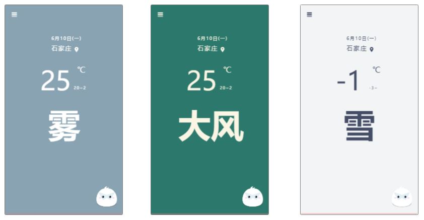
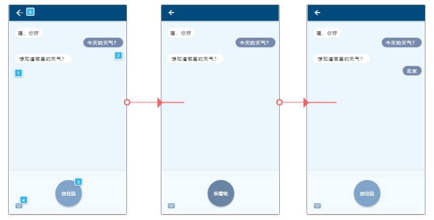

# AskMeWeather-text

> 毕业设计（进行中）
>
> [AskMeWeather](https://github.com/mutsuo/AskMeWeather)第二代，安卓应用

## 介绍

AskMeWeather text是一款天气查询软件，简洁易用，内嵌两种机器人，您既可以使用自然语言查询天气，也可以与机器人聊天！

### 天气首页

在首页，使用纯文字排版展示基本天气信息，应用的主题会随着天气发生变化。

### 对话

在对话界面，您可以尝试与bot对话。您可以键入文字，或使用语音。

## 权限

注册登录后，您可以选择将您的设置同步到云端。同时可选购套餐，来探索更多功能。 

| 用户类型 | 实时天气 | 天气 | 温度 | 相对湿度 | 能见度 | 风向 | 风速 | 风力等级 | 日出日落 | 生活指数     | 机动车尾号限行 |
| :------: | :------: | ---- | ---- | -------- | :----: | ---- | ---- | -------- | -------- | ------------ | -------------- |
| 普通用户 |    √     | √    | √    |          |        |      |      |          |          | 仅支持基本类 |                |
|   会员   |    √     | √    | √    | √        |   √    | √    | √    | √        | √        | 支持5大类    | √              |
